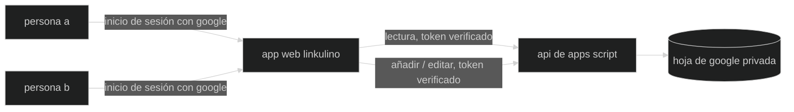

🇬🇧 [English](README.md) · 🇮🇹 [Italiano](README.it.md) · 🇪🇸 Español

# linkulino

una app web inteligente y amigable para hogares y grupos pequeños que gestionan gastos compartidos juntos — controlando presupuestos, dividiendo cuentas y manteniendo a todos sincronizados.

**linkulino** canaliza el espíritu cerebrito de [Calculín](https://es.wikipedia.org/wiki/Calcul%C3%ADn), el héroe de dibujos animados con cabeza de calculadora que resolvía problemas a fuerza de números. este proyecto toma prestada su destreza con la aritmética para una tarea mucho más pequeña: repartir el alquiler, la compra y alguna escapada de fin de semana, de forma justa, entre dos personas (o más).

## ¿cómo funciona?

los gastos viven en una hoja de google. una web app estática se los muestra a ambos miembros de la pareja — cada uno inicia sesión con google, y cada llamada (incluidas las lecturas) se verifica contra una lista de acceso antes de que la api de google apps script toque la hoja.



## funcionalidades

- ➕ alta y edición rápida de gastos — fecha, descripción, categoría, quién pagó y total, repartido como prefieras (50/50 por defecto), más una nota libre opcional; solo los miembros autenticados y autorizados pueden escribir
- 🧮 cuota por persona calculada automáticamente — cuota %, cuota en tu moneda, y una única línea de "quién le debe a quién" en lugar de mostrar el mismo saldo dos veces
- 🎨 emojis por todas partes — cada persona y cada categoría tiene un icono (configurado en la hoja, editable ahí o añadido desde la app); las categorías pueden crearse al vuelo por usuarios autorizados
- 📊 un panel mensual más una página de resumen completa — totales y medias mensuales/anuales por periodo, vacaciones combinadas, por persona, gastos comunes vs. individuales, y un desglose "las cuatro paredes" entre gastos esenciales y discrecionales, con un tooltip al pasar el ratón sobre cada valor calculado que explica cómo se obtiene
- 🔁 gastos recurrentes — marca una factura (alquiler, internet…) una sola vez y se recrea automáticamente cada mes
- 🧳 una pestaña de vacaciones — crea un viaje nuevo en un paso (el backend construye su pestaña desde cero, fórmulas incluidas) o edita su nombre, icono y fechas más tarde, viéndolo agrupado como en curso / próximo / pasado, con los viajes en curso y próximos mostrados directamente en la página de inicio
- 🔍 búsqueda libre más filtros por categoría, quién pagó, rango de fechas, comunes vs. individuales, o cuatro paredes vs. discrecionales — búsqueda y filtros combinados, sin distinguir mayúsculas ni acentos, comparando cada palabra escrita con descripción, categoría, quién pagó y notas; atajos de un clic para periodos habituales (este/el mes pasado, últimos 7/30/90 días, este/el año pasado…), con los últimos 90 días como vista predeterminada de la portada; salta directamente a una vista filtrada haciendo clic en cualquier valor de la página de resumen
- 🔒 privado por defecto — la hoja nunca se comparte por enlace, y el backend verifica un google id token contra la lista `Users` en **cada** llamada, así que un visitante anónimo no ve ni un byte de tu registro — la sesión sobrevive a una recarga o a una segunda pestaña, hasta que el token de google caduca alrededor de una hora después
- 🎭 una demo integrada — quien no ha iniciado sesión entra en una app plenamente funcional con datos de ejemplo (navega, filtra, añade y edita), así puedes enseñar cómo funciona sin dar tus números; al iniciar sesión, la misma interfaz pasa a tu hoja real
- 🕘 un registro de actividad — cada alta, edición o eliminación (gasto, viaje o categoría) queda registrada con quién, cuándo, y qué cambió exactamente, consultable en su propia página
- 💰 una estimación opcional de tu propia autonomía financiera — anota tus ahorros en la página de ajustes y ve una fecha aproximada en la que se agotarían a tu ritmo de gasto medio mensual; es privada y de autogestión, así que tu pareja nunca la ve aunque la tarjeta de inicio sea compartida
- 📤 exporta tus datos en CSV — una instantánea completa desde la página de ajustes (casa, más cada viaje si marcas la casilla), o una descarga con un clic desde cualquier panel de exactamente lo que se muestra en pantalla, respetando los filtros o el periodo activos
- 🗄️ copias de seguridad diarias de toda la hoja, obtenidas por un cron de cPanel mediante una cuenta de servicio de Google y exportadas a XLSX, protegidas por un `.htaccess` que deniega todo acceso — la rotación mantiene las últimas 14 diarias más 6 mensuales (opcional, configuración autoalojada)
- ⚙️ una pestaña `Users` que hace doble función como lista de participantes y lista de acceso de lectura/escritura, configurada una vez, usada en todas partes
- 🌍 interfaz en english, italiano y español — tu elección te sigue entre dispositivos una vez que inicias sesión, no solo en este navegador

## stack tecnológico

- [vite](https://vitejs.dev/) + [react](https://react.dev/) + [typescript](https://www.typescriptlang.org/) — frontend estático
- [tailwind css](https://tailwindcss.com/) + [shadcn/ui](https://ui.shadcn.com/) — estilos y componentes
- [react-i18next](https://react.i18next.com/) — internacionalización (english / italiano / español)
- [google apps script](https://developers.google.com/apps-script) + [clasp](https://github.com/google/clasp) — api backend vinculada a la hoja
- [google identity services](https://developers.google.com/identity) — inicio de sesión de los usuarios
- [google sheets](https://www.google.com/sheets/about/) — la base de datos
- [ftp-deploy-action](https://github.com/SamKirkland/FTP-Deploy-Action) — despliega a cpanel por ftps en cada push a `master`
- php — un pequeño script invocado por cron en cpanel para la copia de seguridad diaria opcional de la hoja (ver [docs/deployment.md](docs/deployment.md)); nada más en el stack usa php

## estructura del repositorio

```
web/          la spa (vite + react)
apps-script/  la api backend (sincronizada con clasp)
docs/         guías para mantenedores (configuración de la hoja, despliegue, traducciones, mascota)
assets/       material gráfico de marca
```

## ejecuta tu propia instancia

linkulino es una plantilla para quien quiera llevar el control de gastos compartidos con una pareja, compañeros de piso, o un grupo pequeño:

1. copia la plantilla de hoja de google — una pestaña `Users` (lista de participantes + lista de acceso de lectura/escritura), una pestaña `Categorie` (categorías de gasto + emoji), y una pestaña para gastos recurrentes/del hogar (el esquema exacto de columnas está en [docs/sheet-setup.md](docs/sheet-setup.md)). las pestañas de viaje no necesitan configuración manual — la app construye una nueva desde cero cada vez que creas un viaje. mantén la hoja **privada** (la app la lee a través del backend, así que nunca necesita compartirse por enlace)
2. crea un apps script vinculado a tu hoja (Extensions → Apps Script), copia su script id en `apps-script/.clasp.json` (ver `.clasp.example.json`), luego `cd apps-script`, `npm install`, `npx clasp login`, `npm run push` — esto requiere activar antes la apps script api una vez en [script.google.com/home/usersettings](https://script.google.com/home/usersettings). despliégalo como web app ("ejecutar como: yo", "quién tiene acceso: cualquiera"), y ejecuta `setupUsersTab` una vez desde el menú Ejecutar del editor para conceder los permisos (hoja de cálculo + solicitudes externas + triggers), pasando por la pantalla de consentimiento — las funciones que terminan en `_` son privadas de apps script y no aparecen en ese menú. versión paso a paso en [docs/deployment.md](docs/deployment.md#first-time-production-backend-setup)
3. crea un google oauth client id (aplicación web) para el botón de inicio de sesión; añade el origen de tu sitio a sus orígenes javascript autorizados
4. configura los participantes y el client id en el backend:
   - rellena la pestaña `Users`: columnas `Email`, `Name`, `Icon`, una fila por participante — las dos primeras filas con un nombre se convierten en Persona A y B, en orden
   - añade una propiedad de script `OAUTH_CLIENT_ID` (Project Settings → Script Properties) con el client id del paso 3, para que el backend pueda verificar los tokens de inicio de sesión
5. añade una columna `Ricorrente` (después de la columna E) solo a la pestaña del hogar (no a los viajes — lo recurrente no aplica ahí) si quieres gastos recurrentes; luego ejecuta `installMonthlyRecurringTrigger` una vez desde el editor de apps script (menú Ejecutar) para programar el trabajo mensual de recreación automática — ver [docs/sheet-setup.md](docs/sheet-setup.md#recurring-expenses)
6. copia `web/.env.example` a `web/.env.local` y rellena `VITE_API_URL` (tu url `/exec`) y `VITE_GOOGLE_CLIENT_ID` — ambos son públicos, así que también pueden vivir en los secretos del repositorio de github para la acción de despliegue
7. `npm install && npm run build` en `web/`, y aloja la carpeta `dist/` donde vivan tus archivos estáticos (`web/public/.htaccess` se incluye, dando enrutado de spa + cabeceras de seguridad para apache/cpanel)

ambos valores de configuración son seguros de publicar (el client id de oauth es público por diseño, y cada lectura y escritura está protegida en el servidor mediante la verificación del google id-token contra la lista `Users`) — ningún secreto llega jamás al repositorio.

## guías para mantenedores

- [configuración de la hoja](docs/sheet-setup.md) — la disposición exacta de las pestañas, las posiciones de columnas, y cómo distingue el backend las pestañas del hogar de las de viaje
- [despliegue](docs/deployment.md) — la separación entre desarrollo/producción, los secretos del repositorio, y cómo publicar cambios de frontend y backend
- [traducciones](docs/translations.md) — añadir un idioma o cambiar el texto de uno existente
- [actualizar la mascota](docs/updating-the-mascot.md) — regenerar la copia reducida del avatar tras cambiar la animación original

## desarrollo

```bash
cd web && npm install && npm run dev
```

sin `VITE_API_URL` configurado, la spa se ejecuta en **modo simulado (mock)** — una copia en memoria de los datos de prueba en `web/src/api/mock.ts`, así que toda la interfaz funciona sin una cuenta de google y sin backend, y las escrituras persisten durante la sesión. pon una url `/exec` real en `web/.env.local` para trabajar contra una hoja real.

la lógica pura del backend (detección de pestañas, mapeo fila↔objeto, decisiones de autenticación) está probada con pruebas unitarias en node — no hace falta cuenta de google:

```bash
cd apps-script && npm test
```

el trabajo ocurre en la rama `develop`; fusionar a `master` dispara la build y el despliegue por ftp a cpanel vía github actions. desarrollo y producción usan hojas de cálculo separadas — ver [docs/deployment.md](docs/deployment.md).

## licencia

[mit](LICENSE)
