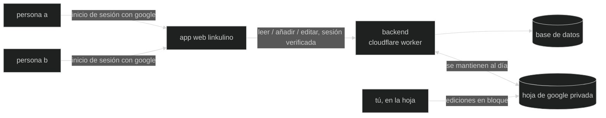

🇬🇧 [English](README.md) · 🇮🇹 [Italiano](README.it.md) · 🇪🇸 Español

# linkulino

una app web inteligente y amigable para hogares y grupos pequeños que gestionan gastos compartidos juntos — controlando presupuestos, dividiendo cuentas y manteniendo a todos sincronizados.

**linkulino** canaliza el espíritu cerebrito de [Calculín](https://es.wikipedia.org/wiki/Calcul%C3%ADn), el héroe de dibujos animados con cabeza de calculadora que resolvía problemas a fuerza de números. este proyecto toma prestada su destreza con la aritmética para una tarea mucho más pequeña: repartir el alquiler, la compra y alguna escapada de fin de semana, de forma justa, entre dos personas (o más).

## ¿cómo funciona?

los gastos viven en una pequeña base de datos detrás del backend de la app, y en una hoja de google que se mantiene al día en ambos sentidos: un guardado en la app llega a la hoja unos segundos después, y una edición en la hoja llega a la app en la siguiente sincronización. una web app estática se los muestra a ambos miembros de la pareja — cada uno inicia sesión con google, y cada llamada (incluidas las lecturas) necesita la sesión de alguien que esté en la lista de acceso de la hoja.


```mermaid
%%{init: {'theme': 'dark'}}%%
flowchart LR
    A[persona a] -->|inicio de sesión con google| SPA[app web linkulino]
    B[persona b] -->|inicio de sesión con google| SPA
    SPA -->|leer / añadir / editar, sesión verificada| API[backend<br/>cloudflare worker]
    API --> DB[(base de datos)]
    API <-->|se mantienen al día| SHEET[(hoja de google privada)]
    YOU[tú, en la hoja] -->|ediciones en bloque| SHEET
```

el backend y la web app están construidos sobre [pomuku](https://github.com/leandroestrella/pomuku), la base común de la que crecen las apps domésticas de este autor.

## funcionalidades

- ➕ alta y edición rápida de gastos — fecha, descripción, categoría, quién pagó y total, repartido como prefieras (50/50 por defecto), más una nota libre opcional; solo los miembros autenticados y autorizados pueden escribir
- 🧮 cuota por persona calculada automáticamente — cuota %, cuota en tu moneda, y una única línea de "quién le debe a quién" en lugar de mostrar el mismo saldo dos veces
- 🎨 emojis por todas partes — cada persona y cada categoría tiene un icono (configurado en la hoja, editable ahí o añadido desde la app); las categorías pueden crearse al vuelo por usuarios autorizados
- 📊 un panel mensual más una página de resumen completa — totales y medias mensuales/anuales por periodo, vacaciones combinadas, por persona, gastos comunes vs. individuales, y un desglose "las cuatro paredes" entre gastos esenciales y discrecionales, con un tooltip al pasar el ratón sobre cada valor calculado que explica cómo se obtiene
- 🔁 gastos recurrentes — marca una factura (alquiler, internet…) una sola vez y se recrea automáticamente cada mes
- 🧳 una pestaña de vacaciones — crea un viaje nuevo en un paso, o edita su nombre, icono y fechas más tarde, viéndolo agrupado como en curso / próximo / pasado, con los viajes en curso y próximos mostrados directamente en la página de inicio
- 🔍 búsqueda libre más filtros por categoría, quién pagó, rango de fechas, comunes vs. individuales, o cuatro paredes vs. discrecionales — búsqueda y filtros combinados, sin distinguir mayúsculas ni acentos, comparando cada palabra escrita con descripción, categoría, quién pagó y notas; atajos de un clic para periodos habituales (este/el mes pasado, últimos 7/30/90 días, este/el año pasado…), con los últimos 90 días como vista predeterminada de la portada; salta directamente a una vista filtrada haciendo clic en cualquier valor de la página de resumen
- 🔒 privado por defecto — la hoja nunca se comparte por enlace, y el backend solo responde a **cada** llamada con la sesión de alguien que esté en la lista `Users`, así que un visitante anónimo no ve ni un byte de tu registro — google responde por ti una vez, y sigues con la sesión iniciada en ese dispositivo durante un mes
- 🎭 una demo integrada — quien no ha iniciado sesión entra en una app plenamente funcional con datos de ejemplo (navega, filtra, añade y edita), así puedes enseñar cómo funciona sin dar tus números; al iniciar sesión, la misma interfaz pasa a tu hoja real
- 🕘 un registro de actividad — cada alta, edición o eliminación (gasto, viaje o categoría) queda registrada con quién, cuándo, y qué cambió exactamente, consultable en su propia página; las ediciones hechas directamente en la hoja también quedan registradas
- ⚡ rápida de abrir — la app guarda en tu dispositivo una copia de lo último que leyó, la muestra al instante, y la actualiza en segundo plano
- 📝 la hoja sigue siendo tuya — una copia completa y editable de todo: escribe o corrige filas ahí en bloque y sincroniza, con una pestaña de resumen hecha de fórmulas (totales y saldo por viaje) que no necesita código
- 💰 una estimación opcional de tu propia autonomía financiera — anota tus ahorros en la página de ajustes y ve una fecha aproximada en la que se agotarían a tu ritmo de gasto medio mensual; es privada y de autogestión, así que tu pareja nunca la ve aunque la tarjeta de inicio sea compartida
- 📤 exporta tus datos en CSV — una instantánea completa desde la página de ajustes (casa, más cada viaje si marcas la casilla), o una descarga con un clic desde cualquier panel de exactamente lo que se muestra en pantalla, respetando los filtros o el periodo activos
- 🗄️ copias de seguridad diarias de toda la hoja, obtenidas por un cron de cPanel mediante una cuenta de servicio de Google y exportadas a XLSX, protegidas por un `.htaccess` que deniega todo acceso — la rotación mantiene las últimas 14 diarias más 6 mensuales (opcional, configuración autoalojada)
- ⚙️ una pestaña `Users` que hace doble función: los dos participantes y la lista de acceso de lectura/escritura, configurada una vez, usada en todas partes
- 🌍 interfaz en english, italiano y español — tu elección te sigue entre dispositivos una vez que inicias sesión, no solo en este navegador

## stack tecnológico

- [vite](https://vitejs.dev/) + [react](https://react.dev/) + [typescript](https://www.typescriptlang.org/) — frontend estático
- [pomuku](https://github.com/leandroestrella/pomuku) — los paquetes compartidos sobre los que se construyen ambas mitades: interfaz, inicio de sesión, cliente de datos y traducciones en la web, y el núcleo del backend (inicio de sesión, lista de acceso, registro de actividad, sincronización con la hoja)
- [tailwind css](https://tailwindcss.com/) + [shadcn/ui](https://ui.shadcn.com/) — estilos y componentes
- [react-i18next](https://react.i18next.com/) — internacionalización (english / italiano / español)
- [hono](https://hono.dev) en [cloudflare workers](https://developers.cloudflare.com/workers/) + [d1](https://developers.cloudflare.com/d1/) — la api backend y su base de datos; basta el plan gratuito
- [google identity services](https://developers.google.com/identity) — inicio de sesión de los usuarios
- [google sheets](https://www.google.com/sheets/about/) — una copia completa y editable de los datos, mantenida al día en ambos sentidos
- [google apps script](https://developers.google.com/apps-script) + [clasp](https://github.com/google/clasp) — solo el menú "sync" de la hoja
- [ftp-deploy-action](https://github.com/SamKirkland/FTP-Deploy-Action) — despliega a cpanel por ftps en cada push a `master`
- php — un pequeño script invocado por cron en cpanel para la copia de seguridad diaria opcional de la hoja (ver [docs/deployment.md](docs/deployment.md)); nada más en el stack usa php

## estructura del repositorio

```
web/          la spa (vite + react)
server/       el backend (un cloudflare worker con una base de datos d1)
apps-script/  el menú sync de la hoja (subido con clasp)
docs/         guías para mantenedores (configuración de la hoja, despliegue, traducciones, mascota)
assets/       material gráfico de marca
```

## ejecuta tu propia instancia

linkulino es una plantilla para quien quiera llevar el control de gastos compartidos con una pareja, compañeros de piso, o un grupo pequeño:

1. prepara la hoja de google — una pestaña `Users` (la lista de acceso y los dos participantes), una pestaña `Categorie` (categorías de gasto + emoji), una pestaña `Spese` (cada gasto) y una pestaña `Viaggi` (los viajes); las columnas exactas están en [docs/sheet-setup.md](docs/sheet-setup.md). mantén la hoja **privada** (la app la lee a través del backend, así que nunca necesita compartirse por enlace)
2. crea un google oauth client id (aplicación web) para el botón de inicio de sesión; añade el origen de tu sitio a sus orígenes javascript autorizados
3. despliega el backend desde `server/` en tu propia cuenta de cloudflare (basta el plan gratuito): una base de datos, unos pocos ajustes (el client id del paso 2, el origen de tu sitio, tu email, el id de la hoja) y `npm run deploy` — paso a paso en [server/README.md](server/README.md#deploy-your-own)
4. conecta la hoja: una cuenta de servicio de google con la que la hoja se comparte como editor, su clave y un secreto de sincronización configurados en el backend, y el menú "sync" de la hoja (`apps-script/sync.js`) subido a la hoja con clasp — ver [server/README.md](server/README.md#connecting-the-sheet). su primer "sync now" trae las filas de la hoja a la app
5. rellena la pestaña `Users`: `Email`, `Name`, `Icon`, una fila por persona, con `A` y `B` en la columna `Persona` para los dos participantes entre los que se reparten los gastos
6. copia `web/.env.example` a `web/.env.local` y rellena `VITE_API_URL` (la dirección de tu backend) y `VITE_GOOGLE_CLIENT_ID` — ambos son públicos, así que también pueden vivir en los secretos del repositorio de github para la acción de despliegue
7. `npm install` en `server/` y en `web/`, luego `npm run build` en `web/`, y aloja la carpeta `dist/` donde vivan tus archivos estáticos (`web/public/.htaccess` se incluye, dando enrutado de spa + cabeceras de seguridad para apache/cpanel)

ambos valores de configuración son seguros de publicar (el client id de oauth es público por diseño, y cada lectura y escritura está protegida en el servidor: cada una necesita la sesión de alguien que esté en la lista `Users`) — ningún secreto llega jamás al repositorio. los ajustes y secretos del backend viven en archivos ignorados por git y en cloudflare.

## guías para mantenedores

- [configuración de la hoja](docs/sheet-setup.md) — las pestañas y columnas con las que se sincroniza el backend, y cómo trabajar en la hoja
- [el backend](server/README.md) — a qué responde, cómo desplegar el tuyo, cómo conectar la hoja
- [despliegue](docs/deployment.md) — la separación entre desarrollo/producción, los secretos del repositorio, y cómo publicar cambios de frontend y backend
- [traducciones](docs/translations.md) — añadir un idioma o cambiar el texto de uno existente
- [actualizar la mascota](docs/updating-the-mascot.md) — regenerar la copia reducida del avatar tras cambiar la animación original

## desarrollo

```bash
cd web && npm install && npm run dev
```

sin `VITE_API_URL` configurado, la spa se ejecuta con **datos de ejemplo** — un backend que vive en la página sobre los datos de prueba en `web/src/api/mock.ts`, así que toda la interfaz funciona sin una cuenta de google y sin backend, y las escrituras duran hasta recargar. pon la dirección de tu backend en `web/.env.local` para trabajar contra uno real.

ambas mitades tienen pruebas, y ninguna necesita cuenta de google: las del backend ejecutan la app real sobre una base de datos local contra una hoja de cálculo mantenida en memoria, y las de la web app ejecutan su cliente contra ese mismo backend.

```bash
cd server && npm install && npm test
cd web && npm test
```

el trabajo ocurre en la rama `develop`; fusionar a `master` dispara la build y el despliegue por ftp a cpanel vía github actions. desarrollo y producción usan hojas de cálculo separadas — ver [docs/deployment.md](docs/deployment.md).

## licencia

[mit](LICENSE)
