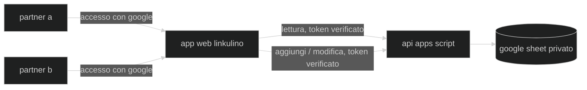

🇬🇧 [English](README.md) · 🇮🇹 Italiano · 🇪🇸 [Español](README.es.md)

# linkulino

un'app web intelligente e amichevole per famiglie e piccoli gruppi che gestiscono le spese condivise insieme — monitorando i budget, dividendo le spese e tenendo tutti sincronizzati.

**linkulino** richiama lo spirito da secchione di [Calculín](https://es.wikipedia.org/wiki/Calcul%C3%ADn), l'eroe dei cartoni animati con la testa a calcolatrice che risolveva i problemi facendo di conto. questo progetto prende in prestito la sua abilità con l'aritmetica per un compito molto più piccolo: dividere l'affitto, la spesa e il weekend fuori porta ogni tanto, in modo equo, tra due persone (o più).

## come funziona?

le spese vivono in un google sheet. una web app statica le mostra a entrambi i partner — ognuno accede con google, e ogni chiamata (comprese le letture) viene verificata contro una lista di accesso prima che l'api di google apps script tocchi il foglio.



## funzionalità

- ➕ aggiunta e modifica rapida delle spese — data, descrizione, categoria, chi ha pagato e totale, diviso come preferisci (50/50 di default), più una nota libera facoltativa; solo i partner autenticati e autorizzati possono scrivere
- 🧮 quota per persona calcolata automaticamente — quota %, quota nella tua valuta, e un'unica riga "chi deve cosa a chi" invece di mostrare due volte lo stesso saldo
- 🎨 emoji ovunque — ogni partner e ogni categoria ha un'icona (impostata sul foglio, modificabile lì o aggiunta dall'app); le categorie possono essere create al volo dagli utenti autorizzati
- 📊 una dashboard mensile più una pagina di riepilogo completa — totali e medie mensili/annuali per periodo, vacanze combinate, per persona, spese comuni vs. individuali, e una ripartizione "le quattro mura" tra spese essenziali e voluttuarie, con un tooltip al passaggio del mouse su ogni valore calcolato che ne spiega il calcolo
- 🔁 spese ricorrenti — segna una bolletta (affitto, internet…) una volta sola e viene ricreata automaticamente ogni mese
- 🧳 una scheda vacanze — crea un nuovo viaggio in un passaggio (il backend costruisce la sua scheda da zero, formule incluse) oppure modifica nome, icona e date in seguito, vedendolo raggruppato come in corso / futuro / passato, con i viaggi in corso e futuri mostrati direttamente nella home
- 🔍 filtra la dashboard per categoria, chi ha pagato, intervallo di date, comuni vs. individuali, o quattro mura vs. voluttuarie — comprese scorciatoie con un clic per i periodi comuni (questo/scorso mese, ultimi 7/30/90 giorni, quest'anno/l'anno scorso…) — e passa direttamente a una vista filtrata cliccando su qualsiasi valore nella pagina di riepilogo
- 🔒 privato per impostazione predefinita — il foglio non è mai condiviso tramite link, e il backend verifica un google id token contro la lista `Users` a **ogni** chiamata, così un visitatore anonimo non vede un solo byte del tuo registro — l'accesso sopravvive a un aggiornamento o a una seconda scheda, finché il token di google non scade circa un'ora dopo
- 🎭 una demo integrata — chi non ha effettuato l'accesso entra in un'app pienamente funzionante con dati di esempio (naviga, filtra, aggiunge e modifica), così puoi mostrare a qualcuno come funziona senza dargli i tuoi numeri; accedendo, la stessa interfaccia passa al tuo foglio reale
- 🕘 un registro attività — ogni aggiunta, modifica o eliminazione (spesa, viaggio o categoria) viene registrata con chi, quando, e cosa è cambiato esattamente, consultabile nella sua pagina
- 💰 una stima facoltativa della propria autonomia finanziaria — registra i tuoi risparmi nella pagina impostazioni e vedi una data approssimativa in cui finirebbero al tuo ritmo di spesa medio mensile; è privata e a autogestione, quindi il tuo partner non la vede mai anche se la scheda della home è condivisa
- 📤 esporta i tuoi dati in CSV — uno snapshot completo dalla pagina impostazioni (casa, più ogni viaggio se selezioni la casella), oppure un download con un clic da qualsiasi dashboard di esattamente ciò che è mostrato a schermo, rispettando i filtri o il periodo attivi
- ⚙️ una scheda `Users` che funge sia da elenco partecipanti sia da lista di accesso in lettura/scrittura, configurata una volta, usata ovunque
- 🌍 interfaccia in english, italiano ed español — la tua scelta ti segue tra i dispositivi una volta effettuato l'accesso, non solo in questo browser

## stack tecnologico

- [vite](https://vitejs.dev/) + [react](https://react.dev/) + [typescript](https://www.typescriptlang.org/) — frontend statico
- [tailwind css](https://tailwindcss.com/) + [shadcn/ui](https://ui.shadcn.com/) — stile e componenti
- [react-i18next](https://react.i18next.com/) — internazionalizzazione (english / italiano / español)
- [google apps script](https://developers.google.com/apps-script) + [clasp](https://github.com/google/clasp) — api backend collegata al foglio
- [google identity services](https://developers.google.com/identity) — accesso dei partner
- [google sheets](https://www.google.com/sheets/about/) — il database
- [ftp-deploy-action](https://github.com/SamKirkland/FTP-Deploy-Action) — pubblica su cpanel via ftps a ogni push su `master`

## struttura del repository

```
web/          la spa (vite + react)
apps-script/  l'api backend (sincronizzata con clasp)
docs/         guide per i manutentori (setup del foglio, deploy, traduzioni, mascotte)
assets/       materiale grafico del brand
```

## avvia la tua istanza

linkulino è un modello per chiunque voglia tracciare le spese condivise con un partner, coinquilini, o un piccolo gruppo:

1. copia il modello di google sheet — una scheda `Users` (elenco partecipanti + lista di accesso in lettura/scrittura), una scheda `Categorie` (categorie di spesa + emoji), e una scheda per le spese ricorrenti/di casa (lo schema esatto delle colonne è in [docs/sheet-setup.md](docs/sheet-setup.md)). le schede dei viaggi non richiedono alcuna configurazione manuale — l'app ne costruisce una nuova da zero ogni volta che crei un viaggio. mantieni il foglio **privato** (l'app lo legge tramite il backend, quindi non deve mai essere condiviso via link)
2. crea un apps script collegato al tuo foglio (Extensions → Apps Script), copia il suo script id in `apps-script/.clasp.json` (vedi `.clasp.example.json`), poi `cd apps-script`, `npm install`, `npx clasp login`, `npm run push` — serve prima attivare l'apps script api una volta su [script.google.com/home/usersettings](https://script.google.com/home/usersettings). distribuiscilo come web app ("esegui come: me", "chi ha accesso: chiunque"), ed esegui `setupUsersTab` una volta dal menu Esegui dell'editor per concedere gli scope (foglio di calcolo + richieste esterne + trigger), passando attraverso la schermata di consenso — le funzioni che terminano con `_` sono private di apps script e non compaiono in quel menu. versione passo-passo in [docs/deployment.md](docs/deployment.md#first-time-production-backend-setup)
3. crea un google oauth client id (applicazione web) per il pulsante di accesso; aggiungi l'origine del tuo sito alle sue origini javascript autorizzate
4. configura i partecipanti e il client id sul backend:
   - compila la scheda `Users`: colonne `Email`, `Name`, `Icon`, una riga per partecipante — le prime due righe con un nome diventano Persona A e B, in ordine
   - aggiungi una proprietà di script `OAUTH_CLIENT_ID` (Project Settings → Script Properties) con il client id del passaggio 3, così il backend può verificare i token di accesso
5. aggiungi una colonna `Ricorrente` (dopo la colonna E) solo alla scheda di casa (non ai viaggi — le ricorrenti non si applicano lì) se vuoi le spese ricorrenti; poi esegui `installMonthlyRecurringTrigger` una volta dall'editor di apps script (menu Esegui) per programmare il job mensile di ricreazione automatica — vedi [docs/sheet-setup.md](docs/sheet-setup.md#recurring-expenses)
6. copia `web/.env.example` in `web/.env.local` e compila `VITE_API_URL` (il tuo url `/exec`) e `VITE_GOOGLE_CLIENT_ID` — entrambi sono pubblici, quindi possono anche vivere nei secret del repository github per l'azione di deploy
7. `npm install && npm run build` in `web/`, e ospita la cartella `dist/` ovunque vivano i file statici (`web/public/.htaccess` viene incluso, fornendo il routing spa + gli header di sicurezza per apache/cpanel)

entrambi i valori di configurazione sono sicuri da pubblicare (il client id oauth è pubblico per design, e ogni lettura e scrittura è protetta lato server dalla verifica del google id-token contro la lista `Users`) — nessun segreto finisce mai nel repository.

## guide per i manutentori

- [setup del foglio](docs/sheet-setup.md) — la disposizione esatta delle schede, le posizioni delle colonne, e come il backend distingue le schede di casa da quelle dei viaggi
- [deploy](docs/deployment.md) — la separazione tra sviluppo/produzione, i secret del repository, e come pubblicare le modifiche a frontend e backend
- [traduzioni](docs/translations.md) — aggiungere una lingua o modificare il testo di una esistente
- [aggiornare la mascotte](docs/updating-the-mascot.md) — rigenerare la copia ridimensionata dell'avatar dopo aver cambiato l'animazione sorgente

## sviluppo

```bash
cd web && npm install && npm run dev
```

senza `VITE_API_URL` impostato, la spa gira in **modalità mock** — una copia in memoria dei dati di prova in `web/src/api/mock.ts`, così l'intera interfaccia funziona senza un account google e senza backend, e le scritture persistono per la sessione. inserisci un url `/exec` reale in `web/.env.local` per lavorare con un foglio dal vivo.

la logica pura del backend (individuazione delle schede, mappatura riga↔oggetto, decisioni di autenticazione) è testata con unit test in node — nessun account google necessario:

```bash
cd apps-script && npm test
```

il lavoro avviene sul branch `develop`; unire a `master` avvia la build e il deploy ftp su cpanel tramite github actions. sviluppo e produzione usano fogli di calcolo separati — vedi [docs/deployment.md](docs/deployment.md).

## licenza

[mit](LICENSE)
