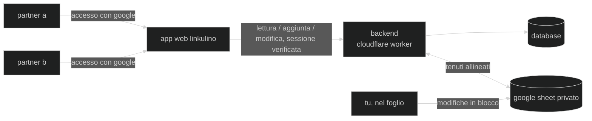

🇬🇧 [English](README.md) · 🇮🇹 Italiano · 🇪🇸 [Español](README.es.md)

# linkulino

un'app web intelligente e amichevole per famiglie e piccoli gruppi che gestiscono le spese condivise insieme — monitorando i budget, dividendo le spese e tenendo tutti sincronizzati.

**linkulino** richiama lo spirito da secchione di [Calculín](https://es.wikipedia.org/wiki/Calcul%C3%ADn), l'eroe dei cartoni animati con la testa a calcolatrice che risolveva i problemi facendo di conto. questo progetto prende in prestito la sua abilità con l'aritmetica per un compito molto più piccolo: dividere l'affitto, la spesa e il weekend fuori porta ogni tanto, in modo equo, tra due persone (o più).

## come funziona?

le spese vivono in un piccolo database dietro il backend dell'app, e in un google sheet tenuto allineato in entrambe le direzioni: un salvataggio nell'app arriva al foglio pochi secondi dopo, e una modifica nel foglio arriva all'app alla sincronizzazione successiva. una web app statica le mostra a entrambi i partner — ognuno accede con google, e ogni chiamata (comprese le letture) richiede la sessione di qualcuno presente nella lista di accesso del foglio.


```mermaid
%%{init: {'theme': 'dark'}}%%
flowchart LR
    A[partner a] -->|accesso con google| SPA[app web linkulino]
    B[partner b] -->|accesso con google| SPA
    SPA -->|lettura / aggiunta / modifica, sessione verificata| API[backend<br/>cloudflare worker]
    API --> DB[(database)]
    API <-->|tenuti allineati| SHEET[(google sheet privato)]
    YOU[tu, nel foglio] -->|modifiche in blocco| SHEET
```

il backend e la web app sono costruiti su [pomuku](https://github.com/leandroestrella/pomuku), la base comune da cui crescono le app di casa di questo autore.

## funzionalità

- ➕ aggiunta e modifica rapida delle spese — data, descrizione, categoria, chi ha pagato e totale, diviso come preferisci (50/50 di default), più una nota libera facoltativa; solo i partner autenticati e autorizzati possono scrivere
- 🧮 quota per persona calcolata automaticamente — quota %, quota nella tua valuta, e un'unica riga "chi deve cosa a chi" invece di mostrare due volte lo stesso saldo
- 🎨 emoji ovunque — ogni partner e ogni categoria ha un'icona (impostata sul foglio, modificabile lì o aggiunta dall'app); le categorie possono essere create al volo dagli utenti autorizzati
- 📊 una dashboard mensile più una pagina di riepilogo completa — totali e medie mensili/annuali per periodo, vacanze combinate, per persona, spese comuni vs. individuali, e una ripartizione "le quattro mura" tra spese essenziali e voluttuarie, con un tooltip al passaggio del mouse su ogni valore calcolato che ne spiega il calcolo
- 🔁 spese ricorrenti — segna una bolletta (affitto, internet…) una volta sola e viene ricreata automaticamente ogni mese
- 🧳 una scheda vacanze — crea un nuovo viaggio in un passaggio, oppure modifica nome, icona e date in seguito, vedendolo raggruppato come in corso / futuro / passato, con i viaggi in corso e futuri mostrati direttamente nella home
- 🔍 ricerca libera più filtri per categoria, chi ha pagato, intervallo di date, comuni vs. individuali, o quattro mura vs. voluttuarie — ricerca e filtri combinati, senza distinzione di maiuscole/accenti, che confrontano ogni parola digitata con descrizione, categoria, pagante e note; scorciatoie con un clic per i periodi comuni (questo/scorso mese, ultimi 7/30/90 giorni, quest'anno/l'anno scorso…), con gli ultimi 90 giorni come vista predefinita della home; passa direttamente a una vista filtrata cliccando su qualsiasi valore nella pagina di riepilogo
- 🔒 privato per impostazione predefinita — il foglio non è mai condiviso tramite link, e il backend risponde a **ogni** chiamata solo alla sessione di qualcuno presente nella lista `Users`, così un visitatore anonimo non vede un solo byte del tuo registro — google garantisce per te una volta, e resti connesso su quel dispositivo per un mese
- 🎭 una demo integrata — chi non ha effettuato l'accesso entra in un'app pienamente funzionante con dati di esempio (naviga, filtra, aggiunge e modifica), così puoi mostrare a qualcuno come funziona senza dargli i tuoi numeri; accedendo, la stessa interfaccia passa al tuo foglio reale
- 🕘 un registro attività — ogni aggiunta, modifica o eliminazione (spesa, viaggio o categoria) viene registrata con chi, quando, e cosa è cambiato esattamente, consultabile nella sua pagina; anche le modifiche fatte direttamente nel foglio vengono registrate
- ⚡ veloce da aprire — l'app tiene sul tuo dispositivo una copia di ciò che ha letto l'ultima volta, la mostra subito, e la aggiorna in background
- 📝 il foglio resta tuo — una copia completa e modificabile di tutto: scrivi o correggi righe lì in blocco e sincronizza, con una scheda di riepilogo fatta di formule (totali e saldo per viaggio) che non richiede codice
- 💰 una stima facoltativa della propria autonomia finanziaria — registra i tuoi risparmi nella pagina impostazioni e vedi una data approssimativa in cui finirebbero al tuo ritmo di spesa medio mensile; è privata e a autogestione, quindi il tuo partner non la vede mai anche se la scheda della home è condivisa
- 📤 esporta i tuoi dati in CSV — uno snapshot completo dalla pagina impostazioni (casa, più ogni viaggio se selezioni la casella), oppure un download con un clic da qualsiasi dashboard di esattamente ciò che è mostrato a schermo, rispettando i filtri o il periodo attivi
- 🗄️ backup giornalieri dell'intero foglio, prelevati da un cron job su cPanel tramite un service account Google ed esportati in XLSX, protetti da un `.htaccess` che nega ogni accesso — la rotazione mantiene gli ultimi 14 giornalieri più 6 mensili (opzionale, configurazione self-hosted)
- ⚙️ una scheda `Users` che indica sia i due partecipanti sia la lista di accesso in lettura/scrittura, configurata una volta, usata ovunque
- 🌍 interfaccia in english, italiano ed español — la tua scelta ti segue tra i dispositivi una volta effettuato l'accesso, non solo in questo browser

## stack tecnologico

- [vite](https://vitejs.dev/) + [react](https://react.dev/) + [typescript](https://www.typescriptlang.org/) — frontend statico
- [pomuku](https://github.com/leandroestrella/pomuku) — i pacchetti condivisi su cui sono costruite entrambe le metà: interfaccia, accesso, client dei dati e traduzioni sul web, e il nucleo del backend (accesso, lista di accesso, registro attività, sincronizzazione col foglio)
- [tailwind css](https://tailwindcss.com/) + [shadcn/ui](https://ui.shadcn.com/) — stile e componenti
- [react-i18next](https://react.i18next.com/) — internazionalizzazione (english / italiano / español)
- [hono](https://hono.dev) su [cloudflare workers](https://developers.cloudflare.com/workers/) + [d1](https://developers.cloudflare.com/d1/) — l'api backend e il suo database; basta il piano gratuito
- [google identity services](https://developers.google.com/identity) — accesso dei partner
- [google sheets](https://www.google.com/sheets/about/) — una copia completa e modificabile dei dati, tenuta allineata in entrambe le direzioni
- [google apps script](https://developers.google.com/apps-script) + [clasp](https://github.com/google/clasp) — solo il menu "sync" del foglio
- [ftp-deploy-action](https://github.com/SamKirkland/FTP-Deploy-Action) — pubblica su cpanel via ftps a ogni push su `master`
- php — un piccolo script invocato da cron su cpanel per il backup giornaliero opzionale del foglio (vedi [docs/deployment.md](docs/deployment.md)); nient'altro nello stack usa php

## struttura del repository

```
web/          la spa (vite + react)
server/       il backend (un cloudflare worker con un database d1)
apps-script/  il menu sync del foglio (caricato con clasp)
docs/         guide per i manutentori (setup del foglio, deploy, traduzioni, mascotte)
assets/       materiale grafico del brand
```

## avvia la tua istanza

linkulino è un modello per chiunque voglia tracciare le spese condivise con un partner, coinquilini, o un piccolo gruppo:

1. prepara il google sheet — una scheda `Users` (la lista di accesso e i due partecipanti), una scheda `Categorie` (categorie di spesa + emoji), una scheda `Spese` (ogni spesa) e una scheda `Viaggi` (i viaggi); le colonne esatte sono in [docs/sheet-setup.md](docs/sheet-setup.md). mantieni il foglio **privato** (l'app lo legge tramite il backend, quindi non deve mai essere condiviso via link)
2. crea un google oauth client id (applicazione web) per il pulsante di accesso; aggiungi l'origine del tuo sito alle sue origini javascript autorizzate
3. pubblica il backend da `server/` sul tuo account cloudflare (basta il piano gratuito): un database, poche impostazioni (il client id del passaggio 2, l'origine del tuo sito, la tua email, l'id del foglio) e `npm run deploy` — passo per passo in [server/README.md](server/README.md#deploy-your-own)
4. collega il foglio: un service account di google con cui il foglio è condiviso come editor, la sua chiave e un segreto di sincronizzazione impostati sul backend, e il menu "sync" del foglio (`apps-script/sync.js`) caricato nel foglio con clasp — vedi [server/README.md](server/README.md#connecting-the-sheet). il suo primo "sync now" porta le righe del foglio nell'app
5. compila la scheda `Users`: `Email`, `Name`, `Icon`, una riga per persona, con `A` e `B` nella colonna `Persona` per i due partecipanti tra cui si dividono le spese
6. copia `web/.env.example` in `web/.env.local` e compila `VITE_API_URL` (l'indirizzo del tuo backend) e `VITE_GOOGLE_CLIENT_ID` — entrambi sono pubblici, quindi possono anche vivere nei secret del repository github per l'azione di deploy
7. `npm install` in `server/` e in `web/`, poi `npm run build` in `web/`, e ospita la cartella `dist/` ovunque vivano i file statici (`web/public/.htaccess` viene incluso, fornendo il routing spa + gli header di sicurezza per apache/cpanel)

entrambi i valori di configurazione sono sicuri da pubblicare (il client id oauth è pubblico per design, e ogni lettura e scrittura è protetta lato server: ciascuna richiede la sessione di qualcuno presente nella lista `Users`) — nessun segreto finisce mai nel repository. le impostazioni e i segreti del backend vivono in file ignorati da git e su cloudflare.

## guide per i manutentori

- [setup del foglio](docs/sheet-setup.md) — le schede e le colonne con cui il backend si sincronizza, e come lavorare nel foglio
- [il backend](server/README.md) — a cosa risponde, come pubblicare il tuo, come collegare il foglio
- [deploy](docs/deployment.md) — la separazione tra sviluppo/produzione, i secret del repository, e come pubblicare le modifiche a frontend e backend
- [traduzioni](docs/translations.md) — aggiungere una lingua o modificare il testo di una esistente
- [aggiornare la mascotte](docs/updating-the-mascot.md) — rigenerare la copia ridimensionata dell'avatar dopo aver cambiato l'animazione sorgente

## sviluppo

```bash
cd web && npm install && npm run dev
```

senza `VITE_API_URL` impostato, la spa gira su **dati di esempio** — un backend che vive nella pagina sopra i dati di prova in `web/src/api/mock.ts`, così l'intera interfaccia funziona senza un account google e senza backend, e le scritture durano fino al ricaricamento. inserisci l'indirizzo del tuo backend in `web/.env.local` per lavorare con uno vero.

entrambe le metà hanno dei test, e nessuna richiede un account google: quelli del backend eseguono l'app vera su un database locale contro un foglio di calcolo tenuto in memoria, e quelli della web app eseguono il suo client contro quello stesso backend.

```bash
cd server && npm install && npm test
cd web && npm test
```

il lavoro avviene sul branch `develop`; unire a `master` avvia la build e il deploy ftp su cpanel tramite github actions. sviluppo e produzione usano fogli di calcolo separati — vedi [docs/deployment.md](docs/deployment.md).

## licenza

[mit](LICENSE)
