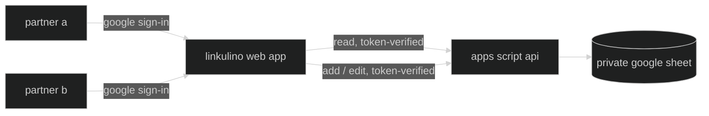

🇬🇧 English · 🇮🇹 [Italiano](README.it.md) · 🇪🇸 [Español](README.es.md)

# linkulino

a smart, friendly web app for households and small groups to manage shared expenses together — tracking budgets, splitting bills, and keeping everyone in sync.

**linkulino** channels the brainy spirit of [Calculín](https://es.wikipedia.org/wiki/Calcul%C3%ADn), the calculator-headed cartoon hero who solved problems by crunching the numbers. this project borrows his knack for arithmetic for a much smaller job: splitting the rent, the groceries, and the odd weekend away, fairly, between two people (or more).

## how it works?

expenses live in a google sheet. a static web app shows them to both partners — each signs in with google, and every call (reads included) is verified against an allowlist before the google apps script api touches the sheet.



## features

- ➕ quick-add and edit for expenses — date, description, category, payer and total, split however you like (defaults to 50/50); only signed-in, allowlisted partners can write
- 🧮 auto-computed share per person — quota %, quota in your currency, and a single "who owes whom" line rather than showing the same balance twice
- 🎨 emoji everywhere — each partner and each category gets an icon (set on the sheet, editable there or added from the app); categories can be created on the fly by authorized users
- 📊 a monthly dashboard plus a full overview page — totals and monthly/yearly averages by timeframe, vacations combined, by person, and common vs. single-user expenses, with a hover tooltip on every calculated figure explaining how it's derived
- 🔁 recurring expenses — flag a bill (rent, internet…) once and it's recreated automatically every month
- 🧳 a vacations tab — spin up a new trip in one step (the backend builds its tab from scratch, formulas included) or edit its name, icon and dates later, see it grouped as current / upcoming / past, with current and upcoming trips surfaced right on the home page
- 🔍 filter the dashboard by category, payer, or date range — including one-click shortcuts for common timeframes (this/last month, last 7/30/90 days, this/last year…) — and jump straight into a filtered view by clicking any value on the overview page
- 🔒 private by default — the sheet is never link-shared, and the backend verifies a google id token against the `Users` allowlist on **every** call, so an anonymous visitor never sees a byte of your ledger
- 🎭 a built-in demo — signed-out visitors land in a fully working app running on sample data (browse, filter, even add and edit), so you can show someone what it does without giving them your numbers; signing in swaps the same UI onto your real sheet
- 🕘 an activity log — every add, edit, or delete (expense, trip, or category) is recorded with who, when, and exactly what changed, browsable on its own page
- ⚙️ a `Users` tab doing double duty as the participant roster and the read/write allowlist, configured once, used everywhere
- 🌍 interface in english, italiano and español

## tech stack

- [vite](https://vitejs.dev/) + [react](https://react.dev/) + [typescript](https://www.typescriptlang.org/) — static frontend
- [tailwind css](https://tailwindcss.com/) + [shadcn/ui](https://ui.shadcn.com/) — styling and components
- [react-i18next](https://react.i18next.com/) — internationalization (english / italiano / español)
- [google apps script](https://developers.google.com/apps-script) + [clasp](https://github.com/google/clasp) — backend api bound to the sheet
- [google identity services](https://developers.google.com/identity) — partner sign-in
- [google sheets](https://www.google.com/sheets/about/) — the database
- [ftp-deploy-action](https://github.com/SamKirkland/FTP-Deploy-Action) — deploys to cpanel over ftps on push to `master`

## repository layout

```
web/          the spa (vite + react)
apps-script/  the backend api (synced with clasp)
docs/         maintainer guides (sheet setup, deployment, translations, mascot)
assets/       brand art
```

## run your own instance

linkulino is a template for anyone who wants to track shared expenses with a partner, roommates, or a small group:

1. copy the google sheet template — a `Users` tab (participant roster + read/write allowlist), a `Categorie` tab (expense categories + emoji), and a tab for recurring/household expenses (the exact column schema is in [docs/sheet-setup.md](docs/sheet-setup.md)). trip tabs don't need any manual setup — the app builds a fresh one from scratch whenever you create a trip. keep the sheet **private** (the app reads it through the backend, so it never needs to be link-shared)
2. create a bound apps script on your sheet (Extensions → Apps Script), copy its script id into `apps-script/.clasp.json` (see `.clasp.example.json`), then `cd apps-script`, `npm install`, `npx clasp login`, `npm run push` — this needs the apps script api switched on once at [script.google.com/home/usersettings](https://script.google.com/home/usersettings). deploy it as a web app ("execute as: me", "who has access: anyone"), and run `setupUsersTab` once from the editor's Run menu to grant the scopes (spreadsheet + external requests + triggers), clicking through the consent screen — functions ending in `_` are private to apps script and won't appear in that menu. step-by-step version in [docs/deployment.md](docs/deployment.md#first-time-production-backend-setup)
3. create a google oauth client id (web application) for the sign-in button; add your site's origin to its authorized javascript origins
4. configure participants & the client id on the backend:
   - fill in the `Users` tab: `Email`, `Name`, `Icon` columns, one row per participant — the first two rows with a name become Persona A and B, in order
   - add a script property `OAUTH_CLIENT_ID` (Project Settings → Script Properties) with the client id from step 3, so the backend can verify sign-in tokens
5. add a `Ricorrente` column (anywhere after column E) to the household tab only (not trips — recurring doesn't apply there) if you want recurring expenses; then run `installMonthlyRecurringTrigger` once from the Apps Script editor (Run menu) to schedule the monthly auto-recreate job — see [docs/sheet-setup.md](docs/sheet-setup.md#recurring-expenses)
6. copy `web/.env.example` to `web/.env.local` and fill in `VITE_API_URL` (your `/exec` url) and `VITE_GOOGLE_CLIENT_ID` — both are public, so they can also live in github repo secrets for the deploy action
7. `npm install && npm run build` in `web/`, and host the `dist/` folder anywhere static files live (`web/public/.htaccess` ships with it, giving apache/cpanel spa routing + security headers)

both config values are safe to publish (the oauth client id is public by design, and every read and write is gated server-side by google id-token verification against the `Users` allowlist) — nothing secret ever lands in the repo.

## maintainer guides

- [sheet setup](docs/sheet-setup.md) — the exact tab layout, column positions, and how the backend tells household/trip tabs apart
- [deployment](docs/deployment.md) — the dev/production split, repo secrets, and how to ship frontend and backend changes
- [translations](docs/translations.md) — adding a language or changing the wording of an existing one
- [updating the mascot](docs/updating-the-mascot.md) — regenerating the downsized avatar copy after changing the source animation

## development

```bash
cd web && npm install && npm run dev
```

with no `VITE_API_URL` set, the spa runs in **mock mode** — an in-memory copy of the fixtures in `web/src/api/mock.ts`, so the whole ui works with no google account and no backend, and writes persist for the session. put a real `/exec` url in `web/.env.local` to work against a live sheet instead.

the backend's pure logic (tab discovery, row↔object mapping, auth decisions) is unit-tested in node — no google account needed:

```bash
cd apps-script && npm test
```

work happens on the `develop` branch; merging to `master` triggers the build and ftp deploy to cpanel via github actions. development and production use separate spreadsheets — see [docs/deployment.md](docs/deployment.md).

## license

[mit](LICENSE)
