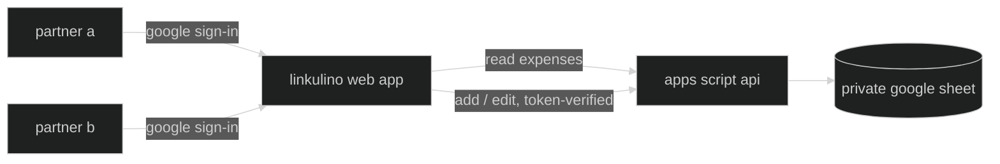

# linkulino

a smart, friendly web app for households and small groups to manage shared expenses together — tracking budgets, splitting bills, and keeping everyone in sync.

**linkulino** channels the brainy spirit of [Calculín](https://es.wikipedia.org/wiki/Calcul%C3%ADn), the calculator-headed cartoon hero who solved problems by crunching the numbers. this project borrows his knack for arithmetic for a much smaller job: splitting the rent, the groceries, and the odd weekend away, fairly, between two people (or more).

## how it works?

expenses live in a google sheet. a static web app reads and displays them for both partners; each signs in with google to add or edit expenses, which flow through a google apps script api back into the sheet.



## features

- ➕ quick-add flow for new expenses — date, description, category, payer and total, split however you like (defaults to 50/50)
- 🧮 auto-computed share per person — quota %, quota in your currency, and a running balance (saldo) of who owes whom
- 📊 clear monthly and yearly views — average spend, totals, and trends for the shared household budget
- 🧳 "side-tracked" expenses for trips — each vacation gets its own tab, spun up from a reusable template, kept separate from the everyday household budget
- ⚙️ settings-driven setup — partner names and preferences configured once, used everywhere

## tech stack

- [vite](https://vitejs.dev/) + [react](https://react.dev/) + [typescript](https://www.typescriptlang.org/) — static frontend
- [tailwind css](https://tailwindcss.com/) + [shadcn/ui](https://ui.shadcn.com/) — styling and components
- [google apps script](https://developers.google.com/apps-script) + [clasp](https://github.com/google/clasp) — backend api bound to the sheet
- [google identity services](https://developers.google.com/identity) — partner sign-in
- [google sheets](https://www.google.com/sheets/about/) — the database
- [ftp-deploy-action](https://github.com/SamKirkland/FTP-Deploy-Action) — deploys to cpanel on push to `master`

## repository layout

```
web/          the spa (vite + react)
apps-script/  the backend api (synced with clasp)
docs/         maintainer guides (sheet setup, categories, translations)
assets/       brand art
```

*(these directories are added as the project takes shape — this initial commit only sets up the repo itself.)*

## run your own instance

linkulino is a template for anyone who wants to track shared expenses with a partner, roommates, or a small group:

1. copy the google sheet template — a settings tab for participant names, a tab for recurring/household expenses, and a trip template tab to duplicate per vacation (the exact column schema will be documented in `docs/sheet-setup.md`). keep it **private** (the app reads it through the backend, so it never needs to be link-shared)
2. create a bound apps script on your sheet: `cd apps-script`, `npm install`, `npx clasp login`, then `clasp clone <scriptId>` (or create the project via the sheet's Extensions → Apps Script and `clasp push`). deploy it as a web app ("execute as: me", "who has access: anyone"). run any function once from the editor to grant the scopes (spreadsheet + external requests), clicking through the consent screen
3. create a google oauth client id (web application) for the sign-in button; add your site's origin to its authorized javascript origins
4. configure participants & the client id on the backend:
   - add a `Users` tab to the sheet and list each participant's email — this tab is the write allowlist
   - add a script property `OAUTH_CLIENT_ID` (Project Settings → Script Properties) with the client id from step 3, so the backend can verify sign-in tokens
5. copy `web/.env.example` to `web/.env.local` and fill in `VITE_API_URL` (your `/exec` url) and `VITE_GOOGLE_CLIENT_ID` — both are public, so they can also live in github repo secrets for the deploy action
6. `npm install && npm run build` in `web/`, and host the `dist/` folder anywhere static files live (an `.htaccess` for spa routing + basic headers will be included for apache/cpanel)

both config values are safe to publish (the oauth client id is public by design, and every write is gated server-side by google id-token verification against the `Users` allowlist) — nothing secret ever lands in the repo.

## development

work happens on the `develop` branch; merging to `master` triggers the build and ftp deploy to cpanel via github actions.

## license

[mit](LICENSE)
