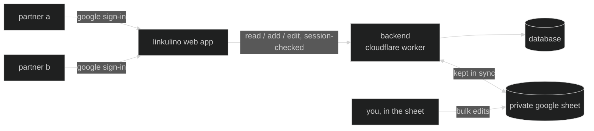

🇬🇧 English · 🇮🇹 [Italiano](README.it.md) · 🇪🇸 [Español](README.es.md)

# linkulino

a smart, friendly web app for households and small groups to manage shared expenses together — tracking budgets, splitting bills, and keeping everyone in sync.

**linkulino** channels the brainy spirit of [Calculín](https://es.wikipedia.org/wiki/Calcul%C3%ADn), the calculator-headed cartoon hero who solved problems by crunching the numbers. this project borrows his knack for arithmetic for a much smaller job: splitting the rent, the groceries, and the odd weekend away, fairly, between two people (or more).

## how it works?

expenses live in a small database behind the app's own backend, and in a google sheet kept in step with it both ways: a save in the app reaches the sheet a few seconds later, and an edit in the sheet reaches the app on the next sync. a static web app shows them to both partners — each signs in with google, and every call (reads included) needs a session of someone on the sheet's allowlist.


```mermaid
%%{init: {'theme': 'dark'}}%%
flowchart LR
    A[partner a] -->|google sign-in| SPA[linkulino web app]
    B[partner b] -->|google sign-in| SPA
    SPA -->|read / add / edit, session-checked| API[backend<br/>cloudflare worker]
    API --> DB[(database)]
    API <-->|kept in sync| SHEET[(private google sheet)]
    YOU[you, in the sheet] -->|bulk edits| SHEET
```

the backend and the web app are built on [pomuku](https://github.com/leandroestrella/pomuku), the common source this author's household apps grow from.

## features

- ➕ quick-add and edit for expenses — date, description, category, payer and total, split however you like (defaults to 50/50), plus an optional free-text note; only signed-in, allowlisted partners can write
- 🧮 auto-computed share per person — quota %, quota in your currency, and a single "who owes whom" line rather than showing the same balance twice
- 🎨 emoji everywhere — each partner and each category gets an icon (set on the sheet, editable there or added from the app); categories can be created on the fly by authorized users
- 📊 a monthly dashboard plus a full overview page — totals and monthly/yearly averages by timeframe, vacations combined, by person, common vs. single-user expenses, and a "four walls" breakdown of essential vs. discretionary spending, with a hover tooltip on every calculated figure explaining how it's derived
- 🔁 recurring expenses — flag a bill (rent, internet…) once and it's recreated automatically every month
- 🧳 a vacations tab — spin up a new trip in one step, or edit its name, icon and dates later, see it grouped as current / upcoming / past, with current and upcoming trips surfaced right on the home page
- 🔍 free-text search plus filters for category, payer, date range, common vs. single-user, or four walls vs. discretionary — search and filters together, accent- and case-insensitive, matching every word typed against description, category, payer and notes; one-click shortcuts for common timeframes (this/last month, last 7/30/90 days, this/last year…), defaulting to the last 90 days on the home page; jump straight into a filtered view by clicking any value on the overview page
- 🔒 private by default — the sheet is never link-shared, and the backend answers **every** call only to a session of someone on the `Users` allowlist, so an anonymous visitor never sees a byte of your ledger — google vouches for you once, and you stay signed in on that device for a month
- 🎭 a built-in demo — signed-out visitors land in a fully working app running on sample data (browse, filter, even add and edit), so you can show someone what it does without giving them your numbers; signing in swaps the same UI onto your real sheet
- 🕘 an activity log — every add, edit, or delete (expense, trip, or category) is recorded with who, when, and exactly what changed, browsable on its own page; edits made straight in the sheet are logged too
- ⚡ quick to open — the app keeps a copy of what it last read on your device, shows it at once, and refreshes it in the background
- 📝 the sheet stays yours — a complete, editable copy of everything: type or fix rows there in bulk and sync, with a summary tab of formulas (totals and balance per trip) that needs no code
- 💰 an optional personal runway estimate — record your own savings on the settings page and see an approximate date they'd run out at your average monthly spend; self-service and private, so your partner never sees it even though the homepage card is shared
- 📤 export your data as CSV — an all-time snapshot from the settings page (household, plus every trip if you check the box), or a one-click download from any dashboard of exactly what's currently on screen, respecting whatever filters or timeframe are active
- 🗄️ daily backups of the whole spreadsheet, pulled by a cPanel cron job via a Google service account and exported to XLSX, stored behind a deny-all `.htaccess` — rotation keeps the last 14 daily plus 6 monthly snapshots (optional, self-hosted setup)
- ⚙️ a `Users` tab doing double duty as the two participants and the read/write allowlist, configured once, used everywhere
- 🌍 interface in english, italiano and español — your choice follows you across devices once signed in, not just this browser

## tech stack

- [vite](https://vitejs.dev/) + [react](https://react.dev/) + [typescript](https://www.typescriptlang.org/) — static frontend
- [pomuku](https://github.com/leandroestrella/pomuku) — the shared packages both halves are built from: ui, sign-in, data client and translations on the web, and the backend core (sign-in, allowlist, history log, sheet sync)
- [tailwind css](https://tailwindcss.com/) + [shadcn/ui](https://ui.shadcn.com/) — styling and components
- [react-i18next](https://react.i18next.com/) — internationalization (english / italiano / español)
- [hono](https://hono.dev) on [cloudflare workers](https://developers.cloudflare.com/workers/) + [d1](https://developers.cloudflare.com/d1/) — the backend api and its database; the free plan is enough
- [google identity services](https://developers.google.com/identity) — partner sign-in
- [google sheets](https://www.google.com/sheets/about/) — a complete, editable copy of the data, kept in sync both ways
- [google apps script](https://developers.google.com/apps-script) + [clasp](https://github.com/google/clasp) — only the sheet's own "sync" menu
- [ftp-deploy-action](https://github.com/SamKirkland/FTP-Deploy-Action) — deploys to cpanel over ftps on push to `master`
- php — a small cron-invoked script on cpanel for the optional daily spreadsheet backup (see [docs/deployment.md](docs/deployment.md)); nothing else in the stack touches php

## repository layout

```
web/          the spa (vite + react)
server/       the backend (a cloudflare worker with a d1 database)
apps-script/  the sheet's sync menu (pushed with clasp)
docs/         maintainer guides (sheet setup, deployment, translations, mascot)
assets/       brand art
```

## run your own instance

linkulino is a template for anyone who wants to track shared expenses with a partner, roommates, or a small group:

1. set up the google sheet — a `Users` tab (the allowlist and the two participants), a `Categorie` tab (expense categories + emoji), a `Spese` tab (every expense) and a `Viaggi` tab (the trips); the exact columns are in [docs/sheet-setup.md](docs/sheet-setup.md). keep the sheet **private** (the app reads it through the backend, so it never needs to be link-shared)
2. create a google oauth client id (web application) for the sign-in button; add your site's origin to its authorized javascript origins
3. deploy the backend from `server/` to your own cloudflare account (the free plan is enough): a database, a few settings (the client id from step 2, your site's origin, your email, the sheet's id) and `npm run deploy` — step by step in [server/README.md](server/README.md#deploy-your-own)
4. connect the sheet: a google service account the sheet is shared with as an editor, its key and a sync secret set on the backend, and the sheet's "sync" menu (`apps-script/sync.js`) pushed to the sheet with clasp — see [server/README.md](server/README.md#connecting-the-sheet). its first "sync now" brings the sheet's rows into the app
5. fill in the `Users` tab: `Email`, `Name`, `Icon`, one row per person, with `A` and `B` in the `Persona` column for the two participants expenses are split between
6. copy `web/.env.example` to `web/.env.local` and fill in `VITE_API_URL` (your backend's address) and `VITE_GOOGLE_CLIENT_ID` — both are public, so they can also live in github repo secrets for the deploy action
7. `npm install` in `server/` and in `web/`, then `npm run build` in `web/`, and host the `dist/` folder anywhere static files live (`web/public/.htaccess` ships with it, giving apache/cpanel spa routing + security headers)

both config values are safe to publish (the oauth client id is public by design, and every read and write is gated server-side: each needs a session of someone on the `Users` allowlist) — nothing secret ever lands in the repo. the backend's own settings and secrets live in gitignored files and in cloudflare.

## maintainer guides

- [sheet setup](docs/sheet-setup.md) — the tabs and columns the backend syncs with, and how to work in the sheet
- [the backend](server/README.md) — what it answers, deploying your own, connecting the sheet
- [deployment](docs/deployment.md) — the dev/production split, repo secrets, and how to ship frontend and backend changes
- [translations](docs/translations.md) — adding a language or changing the wording of an existing one
- [updating the mascot](docs/updating-the-mascot.md) — regenerating the downsized avatar copy after changing the source animation

## development

```bash
cd web && npm install && npm run dev
```

with no `VITE_API_URL` set, the spa runs on **sample data** — a backend that lives in the page over the fixtures in `web/src/api/mock.ts`, so the whole ui works with no google account and no backend, and writes last until a reload. put your backend's address in `web/.env.local` to work against a real one instead.

both halves have tests, and neither needs a google account: the backend's run the real app on a local database against a spreadsheet kept in memory, and the web app's run its client against that same backend.

```bash
cd server && npm install && npm test
cd web && npm test
```

work happens on the `develop` branch; merging to `master` triggers the build and ftp deploy to cpanel via github actions. development and production use separate spreadsheets — see [docs/deployment.md](docs/deployment.md).

## license

[mit](LICENSE)
